# Chương 2. Xây dựng mô hình.

## 2.1 Điều chỉnh mô hình.

### 2.1.1 Ga-ra.
Ga-ra cho phép bạn tạo và tùy chỉnh những chiếc xe ảo của riêng mình mà sau đó bạn sẽ sử dụng để đào tạo các mô hình. Theo mặc định, Ga-ra chứa The Original DeepRacer. DeepRacer ban đầu sử dụng một máy ảnh mặt trước, mạng nơ-ron phức hợp 3 lớp.

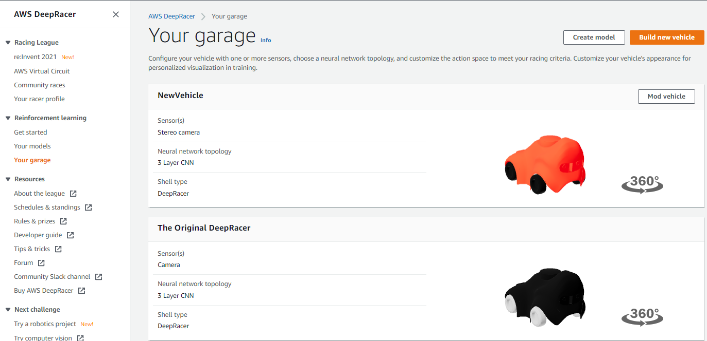
### 2.1.2 Tùy chỉnh mô hình của mình.
- Ngoại hình: Mặc định chỉ có 1 Vehical model, thay vào đó chúng ta có thể đổi màu cho Vehical model

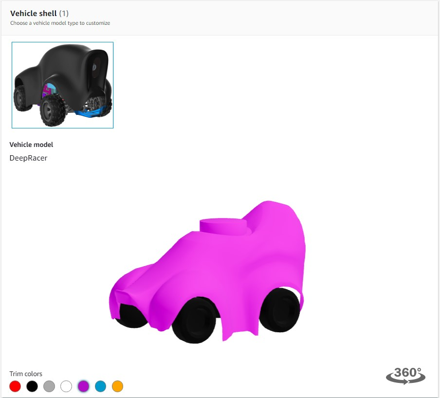

- Camera:
	- Nếu bạn muốn đua trên một chiếc xe duy nhất trên đường đua time-trial , hãy cân nhắc sử dụng camera đơn. Để đua quanh một đường đua mà không có xe hoặc chướng ngại vật khác, bạn không cần phải có đầu vào phức tạp, hơn nữa, bạn càng đi càng phức tạp thì quá trình đào tạo sẽ mất nhiều thời gian hơn.
	- Cân nhắc sử dụng cảm biến camera âm thanh nổi khi bạn muốn xây dựng mô hình tránh vật thể hoặc mô hình đua xe head-to-head. Bạn sẽ cần sử dụng chức năng phần thưởng theo cách để mô hình học được các đặc điểm chiều sâu từ hình ảnh của bạn, điều có thể làm được với máy ảnh âm thanh nổi. Lưu ý rằng trong các mô hình đua xe đối đầu, camera âm thanh nổi có thể không đủ để che các điểm mù.
	- Cân nhắc thêm LIDAR vào mô hình của bạn nếu bạn muốn tham gia vào các cuộc đua head-to-head. Cảm biến LIDAR hướng về phía sau và quét cách xe khoảng 0,5m. Nó sẽ phát hiện những chiếc xe đang tiến đến từ phía sau hoặc trong những điểm mù khi rẽ.

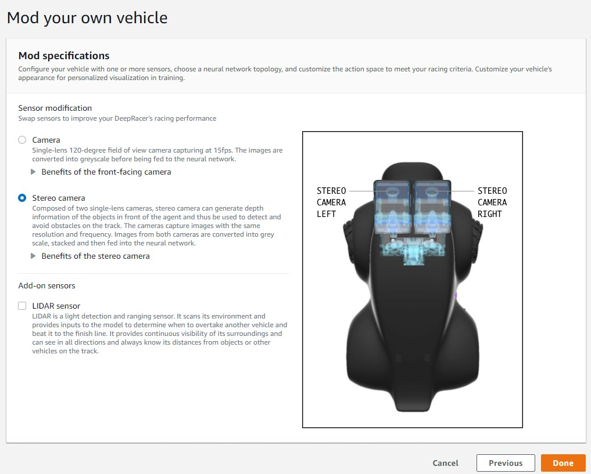
## 2.2 Xây dựng mô hình.

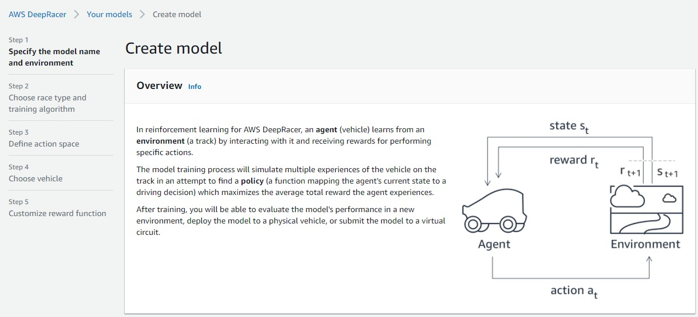

### 2.2.1 Tên mô hình và loại đường đua.
- Chọn tên cho mô hình, thêm mô tả (nếu có)


- Chọn đường đua để huấn luyện mô hình

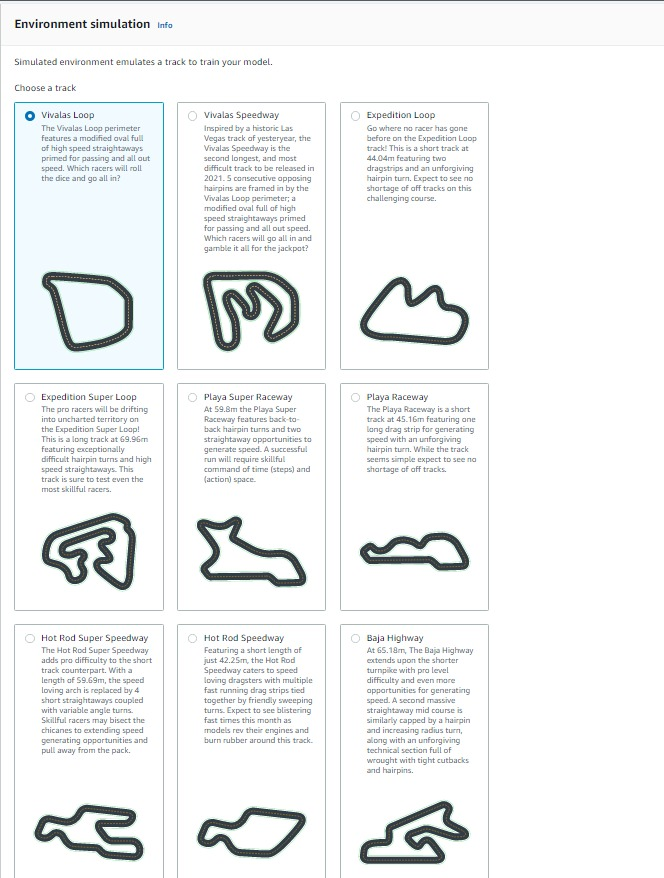

### 2.2.2 Hình thức đua.
- Time trial: chạy đua với đồng hồ trên một đường đua được đánh dấu rõ ràng mà không có chướng ngại vật cố định hoặc đối thủ cạnh tranh đang di chuyển.

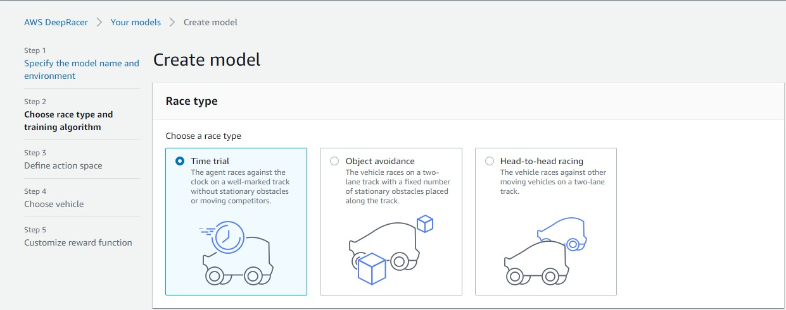

- Object avoidance: Xe chạy trên đường hai làn với một số chướng ngại vật cố định được đặt dọc theo đường.

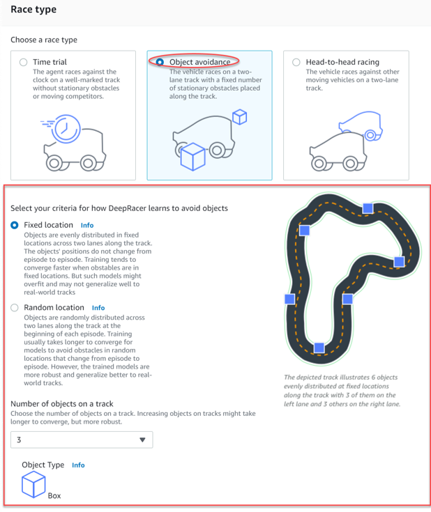
- Head-to-Head: Xe chạy đua với các phương tiện đang di chuyển khác trên đường dành cho hai làn đường.

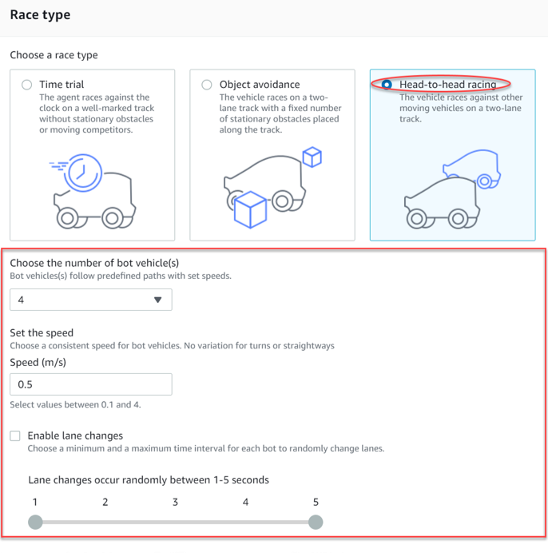
### 2.2.3 Thuật toán huấn luyện và siêu tham số.


- Định nghĩa thuật toán:
	- PPO: Thuật toán tối ưu hóa với policy gần.
	- SAC: Thuật toán tối ưu với policy ngẫu nhiên.
- Lựa chọn giữa hai thuật toán huấn luyện: 

| Proximal Policy Optimization (PPO)  | Soft Actor Critic (SAC) |
| ---------------------------------------------------------------------- | ---------------------------------------------------------------------- |
| Hoạt động trong cả không gian hành động rời rạc và liên tục  | Hoạt động trong không gian hành động liên tục  |
| Học từ những lần thử bây giờ   | Học từ những quan lỗi của mô hình trước  |
| Sử dụng regularization   | Thêm entropy vào mục tiêu tối đa  |

- **Ổn định** (dữ liệu liên tục) so với **Đói dữ liệu** (dữ liệu rời rạc): Thông tin học được bởi các chính sách của thuật toán PPO và SAC trong khi khám phá một môi trường được sử dụng theo cách khác nhau. PPO sử dụng phương pháp học tập theo chính sách có nghĩa là nó học được chức năng giá trị của mình từ những quan sát được thực hiện bởi chính sách hiện tại khám phá môi trường. SAC sử dụng phương pháp học tập ngoài chính sách có nghĩa là nó có thể sử dụng các quan sát được thực hiện bởi quá trình thăm dò môi trường của các chính sách trước đó. Sự cân bằng giữa việc học tập chính sách và học tập đúng chính sách thường là tính ổn định so với hiệu quả dữ liệu. Các thuật toán đúng chính sách có xu hướng ổn định hơn nhưng đói dữ liệu, trong khi các thuật toán ngoài chính sách có xu hướng ngược lại.

- **Khám phá** so với **Khai thác**: Khám phá và khai thác là một thách thức quan trọng trong RL. Một thuật toán nên khai thác thông tin đã biết từ những trải nghiệm trước đó để đạt được phần thưởng tích lũy cao hơn, nhưng nó cũng cần khám phá để có được những trải nghiệm mới có thể được sử dụng để tìm ra chính sách tối ưu trong tương lai. Khi một chính sách được đào tạo qua nhiều lần lặp lại và tìm hiểu thêm về môi trường, chính sách đó trở nên chắc chắn hơn về việc lựa chọn hành động cho một quan sát nhất định. Tuy nhiên, nếu chính sách không đủ khám phá, nó có thể sẽ bám vào thông tin đã được học ngay cả khi nó không ở mức tối ưu. Thuật toán PPO khuyến khích thăm dò bằng cách sử dụng chính quy hóa entropy, điều này ngăn cản các tác nhân hội tụ đến optima cục bộ. Thuật toán SAC đạt được sự cân bằng đặc biệt giữa thăm dò và khai thác bằng cách thêm entropy vào mục tiêu tối đa hóa của nó.

- **Sự hỗn loạn**:
	- Trong ngữ cảnh này, 'entropy' là thước đo độ không chắc chắn trong chính sách, vì vậy nó có thể được hiểu là thước đo mức độ tin cậy của một chính sách khi lựa chọn hành động cho một trạng thái nhất định. Chính sách có entropy thấp rất tự tin trong việc lựa chọn hành động, trong khi chính sách có entropy cao không chắc chắn về việc chọn hành động nào.

	- Chiến lược tối đa hóa entropy của thuật toán SAC có những lợi thế tương tự như việc sử dụng entropy của thuật toán PPO làm bộ điều chỉnh. Giống như PPO, nó khuyến khích khám phá rộng hơn và tránh sự hội tụ đến một điểm tối ưu cục bộ xấu bằng cách khuyến khích tác nhân chọn một hành động có entropy cao hơn. Không giống như điều hòa entropy, tối đa hóa entropy có một lợi thế duy nhất. Nó có xu hướng từ bỏ các chính sách chọn hành vi không thỏa hiệp, đó là một lý do khác khiến thuật toán SAC có xu hướng tiết kiệm dữ liệu hơn PPO.

		- Điều chỉnh lượng entropy trong SAC bằng cách sử dụng siêu thông số SAC alpha. Giá trị entropy SAC alpha tối đa (1,0) cho phép thăm dò. Giá trị tối thiểu (0,0) khôi phục mục tiêu RL tiêu chuẩn và vô hiệu hóa phần thưởng entropy khuyến khích thăm dò. Giá trị alpha SAC tốt để bắt đầu thử nghiệm là 0,5. Điều chỉnh phù hợp khi bạn lặp lại trên các mô hình của mình.

- Hãy thử cả thuật toán PPO và SAC, thử nghiệm với siêu tham số của chúng và khám phá chúng với mỗi lần huấn luyện mô hình.

PPO             |  SAC
:-------------------------:|:-------------------------:
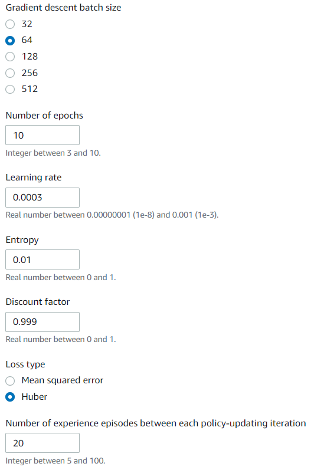  |  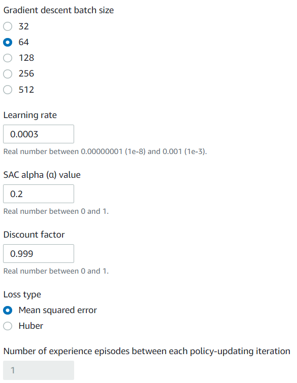


- Định nghĩa các siêu tham số: 

| Tham số                                | Định nghĩa                                                                                                                                                                                                                                                                                                                                                                                                                                                                                                                                                                      |
|------------------------------------------|----------------------------------------------------------------------------------------------------------------------------------------------------------------------------------------------------------------------------------------------------------------------------------------------------------------------------------------------------------------------------------------------------------------------------------------------------------------------------------------------------------------------------------------------------------------------------------|
| Batch size                               | Số lượng experience xe gần đây được lấy mẫu ngẫu nhiên từ bộ đệm trải nghiệm và được sử dụng để cập nhật trọng số mạng nơ-ron. Nếu bạn có 5120 experience trong bộ đệm và chỉ định kích thước batch là 512, sau đó bỏ qua lấy mẫu ngẫu nhiên, bạn sẽ nhận được 10 batch experience. Lần lượt, mỗi batch sẽ được sử dụng để cập nhật trọng số mạng thần kinh của bạn trong quá trình đào tạo. Sử dụng kích thước batch lớn hơn để thúc đẩy cập nhật ổn định và trơn tru hơn đối với trọng số mạng nơ-ron, nhưng lưu ý khả năng quá trình đào tạo có thể chậm hơn. |
| Number of epochs                         |  Một epoch đại diện cho một lần đi qua tất cả các batch, trong đó trọng số mạng nơ-ron được cập nhật sau mỗi batch được xử lý, trước khi tiếp tục với batch tiếp theo. 10 epochs ngụ ý rằng bạn sẽ cập nhật trọng số mạng nơ-ron, sử dụng tất cả các batch một lần, nhưng lặp lại quá trình này 10 lần. Sử dụng số lượng epoch lớn hơn để thúc đẩy các bản cập nhật ổn định hơn, nhưng mong đợi quá trình đào tạo chậm hơn. Khi kích thước batch nhỏ, bạn có thể sử dụng số lượng epoch nhỏ hơn.                                                                                                           |
| Learning rate                            |  Tốc độ học tập kiểm soát mức độ cập nhật đối với trọng số mạng nơ-ron. Nói một cách đơn giản, khi bạn cần thay đổi trọng số của chính sách của mình để đạt được phần thưởng tích lũy tối đa, bạn nên thay đổi chính sách của mình bao nhiêu. Tỷ lệ học tập lớn hơn sẽ dẫn đến đào tạo nhanh hơn, nhưng nó có thể gặp khó khăn để hội tụ. Tỷ lệ học tập nhỏ hơn dẫn đến sự hội tụ ổn định, nhưng có thể mất nhiều thời gian để đào tạo.                                                                                                                                                                   |
| Exploration                              |  Điều này đề cập đến phương pháp được sử dụng để xác định sự đánh đổi giữa thăm dò và khai thác. Nói cách khác, chúng ta nên sử dụng phương pháp nào để xác định khi nào chúng ta nên ngừng khám phá (lựa chọn ngẫu nhiên các hành động) và khi nào chúng ta nên khai thác kinh nghiệm mà chúng ta đã tích lũy được. Vì chúng tôi sẽ sử dụng không gian hành động rời rạc, bạn nên luôn chọn CategoricalParameters.                                                                                                                                                                                                   |
| Entropy                                  | Một mức độ không chắc chắn, hoặc ngẫu nhiên, được thêm vào phân phối xác suất của không gian hành động. Điều này giúp thúc đẩy việc lựa chọn các hành động ngẫu nhiên để khám phá trạng thái / không gian hành động một cách rộng rãi hơn.                                                                                                                                                                                                                                                                                                                                                                            |
| Discount factor                          | Hệ số chỉ định mức độ đóng góp của phần thưởng trong tương lai vào phần thưởng tích lũy dự kiến. Hệ số chiết khấu càng lớn thì mô hình càng xa để xác định phần thưởng tích lũy mong đợi và đào tạo càng chậm. Với hệ số chiết khấu là 0,9, chiếc xe bao gồm phần thưởng từ thứ tự 10 bước trong tương lai để thực hiện một bước di chuyển. Với hệ số chiết khấu là 0,999, chiếc xe sẽ xem xét phần thưởng từ thứ tự 1000 bước trong tương lai để thực hiện một bước đi. Các giá trị hệ số chiết khấu được đề xuất là 0,99, 0,999 và 0,9999.                                         |
| Loss type                                | Loại tổn thất chỉ định loại hàm mục tiêu (hàm chi phí) được sử dụng để cập nhật trọng số mạng. Các loại lỗi mất bình phương Huber và Trung bình hoạt động tương tự đối với các bản cập nhật nhỏ. Nhưng khi các bản cập nhật trở nên lớn hơn, tổn thất Huber có gia số nhỏ hơn so với tổn thất lỗi trung bình bình phương. Khi bạn gặp vấn đề về hội tụ, hãy sử dụng kiểu mất Huber. Khi độ hội tụ tốt và bạn muốn đào tạo nhanh hơn, hãy sử dụng kiểu mất lỗi bình phương trung bình.                                                                                                      |
| Number of episodes between each training |  Thông số này kiểm soát lượng trải nghiệm mà chiếc xe sẽ có được giữa mỗi lần lặp lại đào tạo mô hình. Đối với các vấn đề phức tạp hơn có nhiều cực đại cục bộ hơn, bộ đệm trải nghiệm lớn hơn là cần thiết để cung cấp nhiều điểm dữ liệu không tương quan hơn. Trong trường hợp này, việc đào tạo sẽ chậm hơn nhưng ổn định hơn. Các giá trị được đề xuất là 10, 20 và 40.                           |

### 2.2.4 Cách thức vận hành của mô hình.
- Sự quan trọng của không gian hành động (**action space**): 
	- Trong học tập củng cố, tập hợp tất cả các hành động hoặc lựa chọn hợp lệ, có sẵn cho một mô hình khi nó tương tác với một môi trường được gọi là không gian hành động. Trong bảng điều khiển AWS DeepRacer, bạn có thể đào tạo các nhân viên trong không gian hành động rời rạc hoặc liên tục.
	- Khi đào tạo mô hình AWS DeepRacer, không gian hành động xác định tốc độ và sự kết hợp góc lái nào khả dụng cho mô hình. Một hành động là sự kết hợp tốc độ và góc lái duy nhất hoặc sự lựa chọn mà một mô hình có thể thực hiện.
- Lựa chọn giữa 2 không gian:
	- Không gian liên tục: Không gian hành động liên tục cho phép tác nhân chọn một hành động từ một loạt các giá trị cho mỗi trạng thái.
	- Không gian hành động rời rạc đại diện cho tất cả các hành động có thể có của tác nhân đối với mỗi trạng thái trong một tập hợp hữu hạn.
- Các tham số:
	- **Steering angle** (Góc lái): Góc lái xác định phạm vi góc lái mà bánh trước của mô hình của bạn có thể quay.
	- **Speed** (Tốc độ): Tốc độ mà mô hình có thể đạt được. Tốc độ tối đa/tối thiểu được xác định sẵn cho mô hình. 

Không gian liên tục        |  Không gian rời rạc
:-------------------------:|:-------------------------:
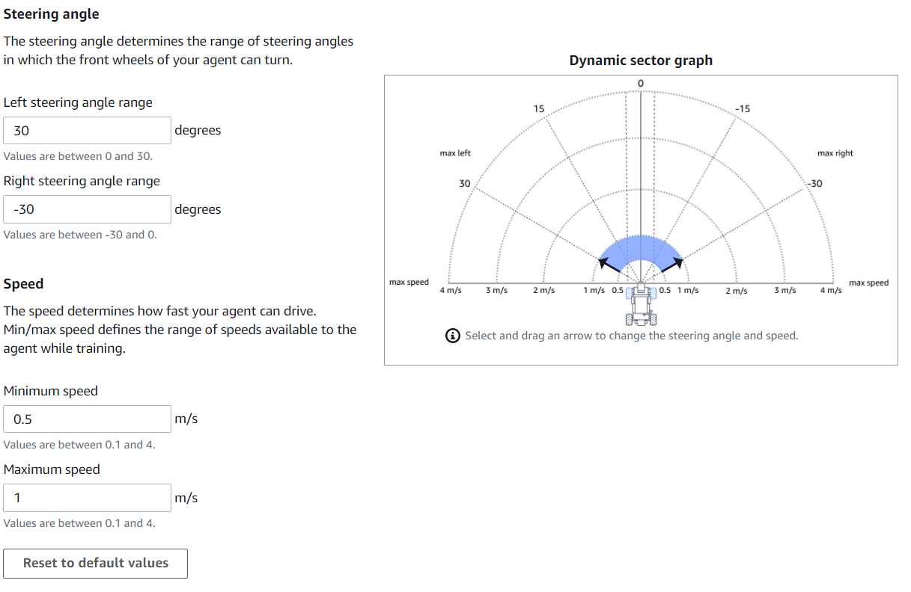  |  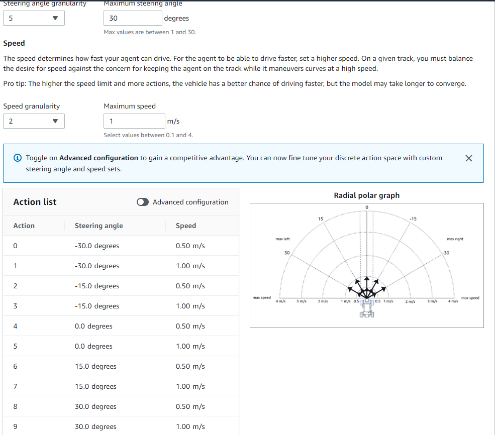

### 2.2.5 Chọn mô hình.
- Có thể chọn mô hình tùy theo ý thích, với hình dưới bên trái là mô hình mình tự tạo, bên phải là mô hình đã được tạo sẵn.

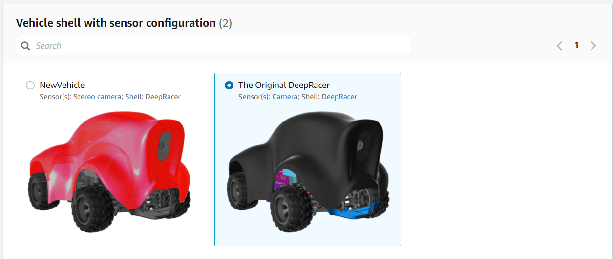

### 2.2.6 Tinh chỉnh các thuật toán thưởng và điều kiện dừng.
* Thuật toán thưởng (Reward Function): model chúng ta có thể thay đổi Reward function để giúp model trở lên tốt hơn. Sau đó nhấn `validate` để đánh giá thuật toán

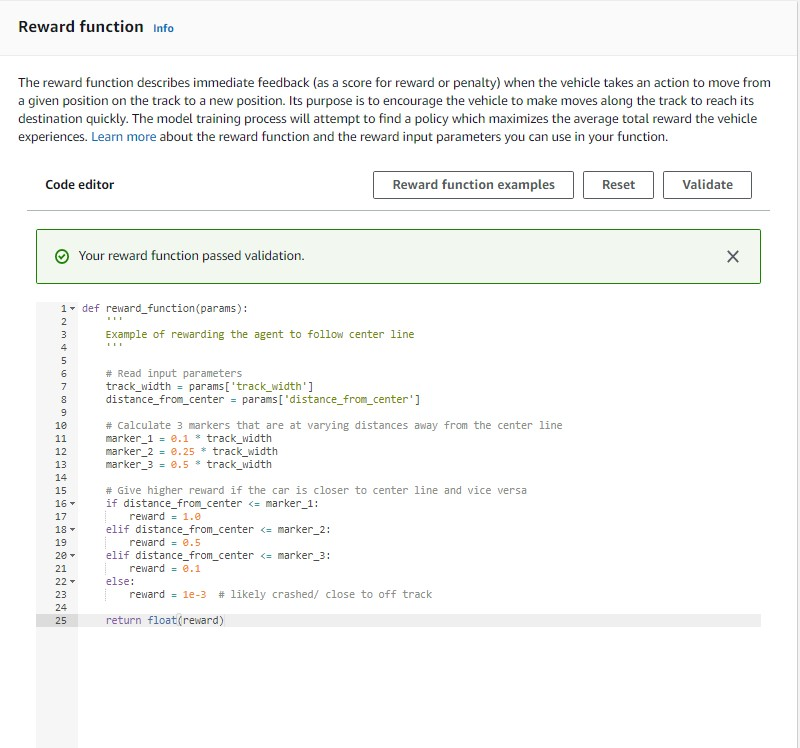

-  Thuật toán thưởng cơ bản (Basic Reward Function): trước tiên chúng ta tạo ba dải xung quanh đường đua, sử dụng ba điểm đánh dấu, sau đó tiến hành thưởng cho chiếc xe nhiều hơn khi lái trong dải hẹp thay vì dải trung bình hoặc dải rộng. Cũng cần lưu ý sự khác biệt về kích thước của phần thưởng. Chúng tôi đưa ra phần thưởng là 1 nếu ở trong dải hẹp, 0,5 nếu ở trong dải trung bình và 0,1 nếu ở trong dải rộng. Nếu chúng tôi giảm phần thưởng cho dải hẹp hoặc tăng phần thưởng cho dải trung bình, về cơ bản chúng tôi đang khuyến khích chiếc xe sử dụng một phần lớn hơn của bề mặt đường đua. Điều này có thể hữu ích, đặc biệt là khi có các góc cua gấp.

```
def reward_function(params):
    '''
    Thưởng theo đường trung tâm Xác định khoảng cách từ xe đến trung tâm và thưởng cao hơn nếu xe ở gần trung tâm hơn 
    (khuyến khích xe theo sát đường trung tâm)
    '''
    # Nhận thông số đầu vào
    track_width = params['track_width']
    distance_from_center = params['distance_from_center']

    # Tính 3 điểm đánh dấu ngày càng xa đường chính giữa 
    marker_1 = 0.1 * track_width
    marker_2 = 0.25 * track_width
    marker_3 = 0.5 * track_width

    # Cho điểm cao hơn nếu xe gần đường trung tâm hơn và ngược lại
    if distance_from_center <= marker_1:
        reward = 1
    elif distance_from_center <= marker_2:
        reward = 0.5
    elif distance_from_center <= marker_3:
        reward = 0.1
    else:
        reward = 1e-3  #đâm / đi chệch hướng

    return reward
```
- Thuật toán thưởng cơ bản: thưởng khi xe đi trong đường biên của đường đua

```
def reward_function(params):
    '''
    Thưởng khi xe lại trong hai đường biên của đường đua
    '''
    
    # Nhận thông số đầu vào
    all_wheels_on_track = params['all_wheels_on_track']
    distance_from_center = params['distance_from_center']
    track_width = params['track_width']
    
    # Mặc định là đưa ra phần thưởng rất thấp 
    reward = 1e-3

    # Trao phần thưởng cao nếu không có bánh xe nào chệch khỏi đường đua và 
    # chiếc ô tô đang ở đâu đó giữa biên giới đường đua
    if all_wheels_on_track and (0.5*track_width - distance_from_center) >= 0.05:
        reward = 1.0

    return reward
```
- Hàm thưởng nâng cao (Advanced reward function) giúp xử phạt việc đánh lái quá mức (chạy zig=zag) và thúc đẩy việc đi theo đường trung tâm.

```
def reward_function(params):
    '''
    Function phạt lái giúp giảm thiểu hành vi lạng lách đánh võng
    '''
    
    # Nhận thông số đầu vào
    distance_from_center = params['distance_from_center']
    track_width = params['track_width']
    abs_steering = abs(params['steering_angle']) # Only need the absolute steering angle

    # Tính 3 điểm xa và xa hơn khỏi đường tâm
    marker_1 = 0.1 * track_width
    marker_2 = 0.25 * track_width
    marker_3 = 0.5 * track_width

    # Thưởng cao hơn nếu xe gần đường trung tâm hơn và ngược lại
    if distance_from_center <= marker_1:
        reward = 1.0
    elif distance_from_center <= marker_2:
        reward = 0.5
    elif distance_from_center <= marker_3:
        reward = 0.1
    else:
        reward = 1e-3  # đâm / đi chệch hướng

    # Ngưỡng phạt lái, thay đổi số dựa trên cài đặt không gian hành động của bạn
    ABS_STEERING_THRESHOLD = 15 

    #  Phạt nếu xe bẻ lái quá nhiều
    if abs_steering > ABS_STEERING_THRESHOLD:
        reward *= 0.8

    return float(reward)
```

- Hàm thưởng nâng cao sẽ trừng phạt việc đi chậm và thúc đẩy việc theo sau đường trung tâm.
```
def reward_function(params):


	# Tính 3 điểm xa và xa hơn khỏi đường tâm
	marker_1 = 0.1 * params['track_width']
	marker_2 = 0.25 * params['track_width']
	marker_3 = 0.5 * params['track_width']

	# Thưởng cao hơn nếu xe gần đường trung tâm hơn và ngược lại
	if params['distance_from_center'] <= marker_1:
		reward = 1
	elif params['distance_from_center'] <= marker_2:
		reward = 0.5
	elif params['distance_from_center'] <= marker_3:
		reward = 0.1
	else:
		reward = 1e-3  # likely crashed/ close to off track

	# Phạt nếu xe chạy với tốc độ dưới 0.5m/s
	SPEED_THRESHOLD = 0.5
	if params['speed'] < SPEED_THRESHOLD:
		reward *= 0.5

	return float(reward)
```
- Hàm thưởng nâng cao cho loại đua head-to-head
```
import math
def reward_function(params):
    '''
    Thưởng cho xe ở trong đường biên và 
    phạt khi đến quá gần các đối tượng khác ở phía trước
    '''
    all_wheels_on_track = params['all_wheels_on_track']
    distance_from_center = params['distance_from_center']
    track_width = params['track_width']
    objects_location = params['objects_location']
    agent_x = params['x']
    agent_y = params['y']
    _, next_object_index = params['closest_objects']
    objects_left_of_center = params['objects_left_of_center']
    is_left_of_center = params['is_left_of_center']

    # Khởi tạo phần thưởng bằng một số nhỏ nhưng không phải số 0 
    # vì số 0 có nghĩa là chệch hướng hoặc gặp sự cố
    reward = 1e-3

    #Thưởng nếu xe ở trong hai biên của đường đua
    if all_wheels_on_track and (0.5 * track_width - distance_from_center) >= 0.05:
        reward_lane = 1.0
    else:
        reward_lane = 1e-3
    # Phạt nếu xe ở quá gần đối tượng tiếp theo
    reward_avoid = 1.0

    # Khoảng cách đến đối tượng khác
    next_object_loc = objects_location[next_object_index]
    distance_closest_object = math.sqrt((agent_x - next_object_loc[0])**2 + (agent_y - next_object_loc[1])**2)
    
    # Quyết định xem xe và đối tượng tiếp theo có trên cùng một làn đường hay không
    is_same_lane = objects_left_of_center[next_object_index] == is_left_of_center
    if is_same_lane:
        if 0.5 <= distance_closest_object < 0.8:
            reward_avoid *= 0.5
        elif 0.3 <= distance_closest_object < 0.5:
            reward_avoid *= 0.2
        elif distance_closest_object < 0.3:
            reward_avoid = 1e-3  # Likely crashed

    # Tính phần thưởng bằng cách đặt các trọng số khác nhau cho 
    # hai khía cạnh ở trên
    reward += 1.0 * reward_lane + 4.0 * reward_avoid
    return reward
```
* Điều kiện dừng huấn luyện sau 1 khoảng thời gian (tính theo phút)

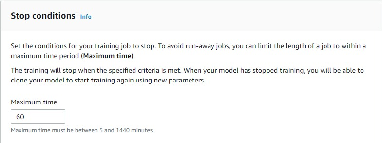
* Ta có thể tích để thử nghiệm độ hiệu quả của mô hình ta đã training được bằng cách tham gia cuộc đua reInvent2021


## 2.3 Đánh giá hiệu suất mô hình.
- Sau khi hoàn tất, mô hình sẽ được khởi tạo

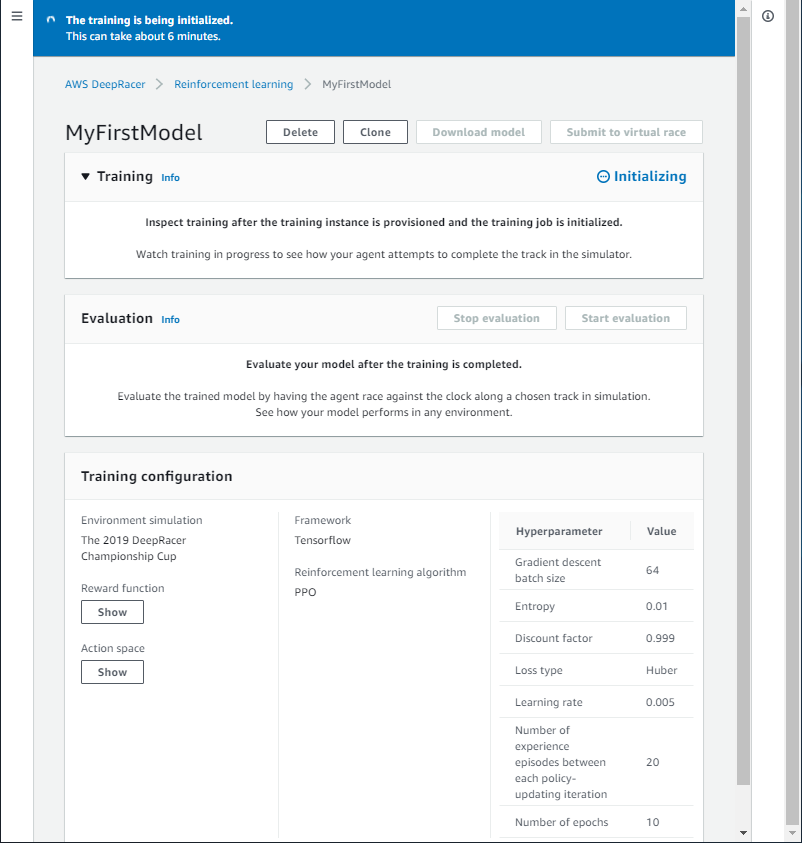

- Khi mô hình của bạn đã được đào tạo một thời gian, bạn sẽ thấy những điều sau:
	- Biểu đồ phần thưởng ở bên trái. Biểu đồ phần thưởng vẽ biểu đồ phần thưởng trung bình cho mỗi lần lặp lại đào tạo và tiến trình trung bình cho mỗi lần lặp lại đào tạo theo mặc định. 
	- Luồng video mô phỏng ở bên phải. Điều này hiển thị luồng video từ trình mô phỏng, cung cấp chế độ xem của người thứ ba về ô tô của bạn khi nó đang học và cũng là chế độ xem bản đồ từ trên không hình trong ảnh hữu ích.

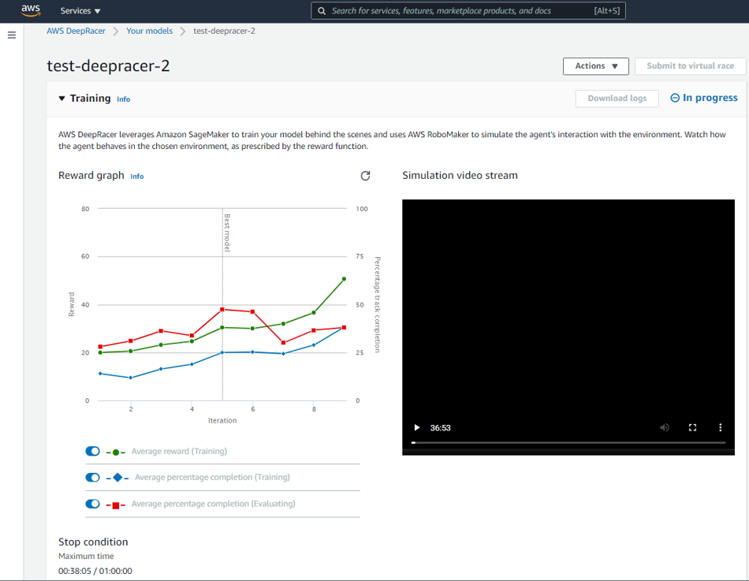

- Stop condition sẽ là điều kiện thời gian mà mô hình sẽ dừng hành động huấn luyện lại.
- Lúc đầu, mô hình của bạn sẽ không thể lái trên đường thẳng nhưng khi nó học được hành vi lái xe tốt hơn, bạn sẽ thấy hiệu suất của nó được cải thiện và biểu đồ phần thưởng tăng lên. Hơn nữa, khi bạn lái xe ra khỏi đường đua, nó sẽ được đặt lại trên đường đua. Mô hình sẽ không phải chạy từ vị trí xuất phát mà sẽ có những điểm lưu vị trí để mô hình có thể tiếp tục huấn luyện của mình. Cuối cùng, nếu bạn thấy mô hình của mình lái chệch hướng và không đặt lại được, thì đây là lúc kinh nghiệm thu được sẽ được gửi lại cho Amazon SageMaker để đào tạo mô hình. Khi mô hình đã được cập nhật, mô hình mới sẽ được gửi lại cho AWS RoboMaker và xe sẽ hoạt động trở lại.
- Sau khi huấn luyện xong, ta có thể thử kiểm tra độ hiệu quả của mô hình, hình dưới là sau khi đã kiểm tra xong độ hiệu quả.

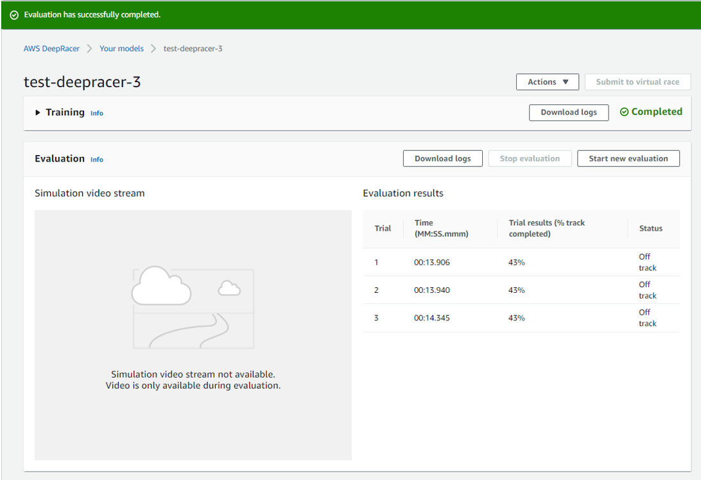
