# Chương 3: re:Invent 2021.

## 3.1 Giới thiệu về re:Invent 2021.

- AWS re:Invent 2021 là một trong những sự kiện điện toán đám mây lớn nhất thế giới, trở lại đánh dấu cột mốc 10 năm với một loạt các buổi đào tạo trực tiếp và ảo, các sự kiện,... Đặc biệt nhất không thể thiếu đó là cuộc đua AWS DeepRacer ở lần sự kiện Re:Invent 2021 này
- Tại đây, tất cả mọi người trên toàn thế giới có thể cùng tham gia vào sự kiện bằng cách sử dụng model mà họ cho là tốt nhất của mình, từ đó giành các thứ hạng cao
- Đối với những người còn đang làm quen với AWS DeepRacer, ta vẫn có thể thử đưa mô hình đã huấn luyện vào đây để xem mô hình đã được huấn luyện tốt thế nào so với cộng đồng, từ đó tiếp tục cải tiến model của mình ngày càng tốt hơn

## 3.2 Cách tham dự.

- Ở trang chính của AWS DeepRacer, chọn mục **Your models** ở bên phải:

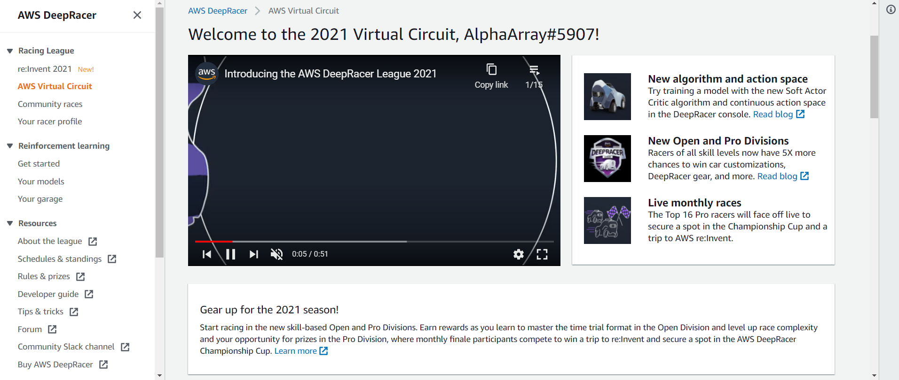

- Chọn một model bất kì

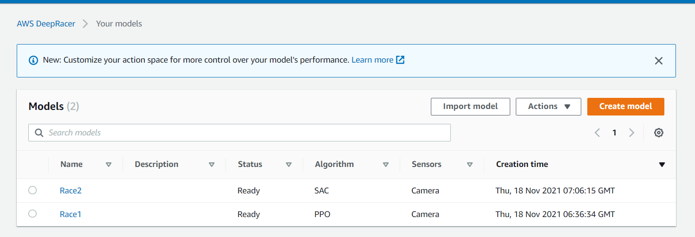

- Nhấn nút **Submit to virtual race**

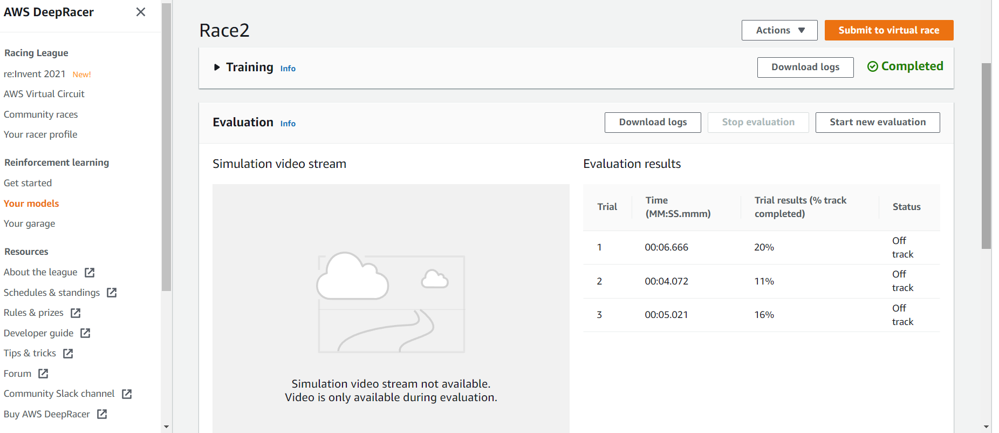

- Bảng cuộc đua Re:Invent 2021 sẽ hiện ra, chọn model mình cảm thấy tốt nhất sau đó nhất **Submit**

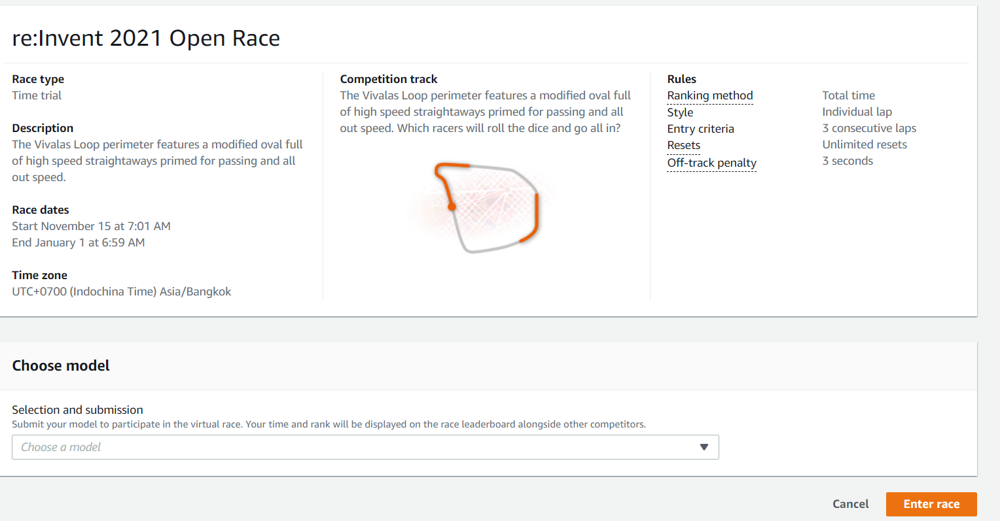

## 3.3 Tự tạo đường đua cho riêng mình.
- Ở trang chính của AWS DeepRacer, chọn mục **Community races** ở bên phải:

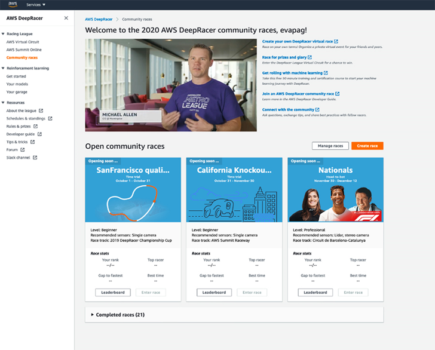

- Chọn nút **Create race**

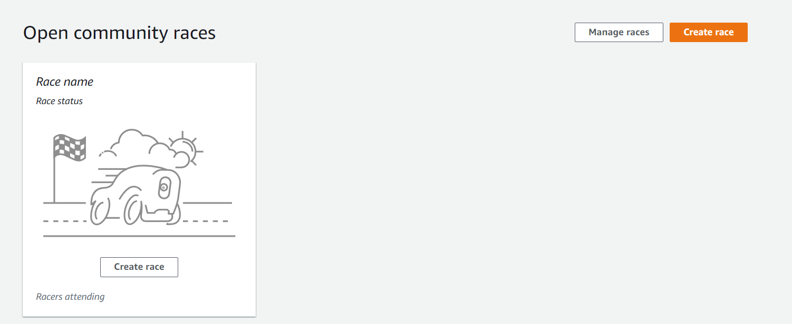

- Chọn format đua và cách thức đua

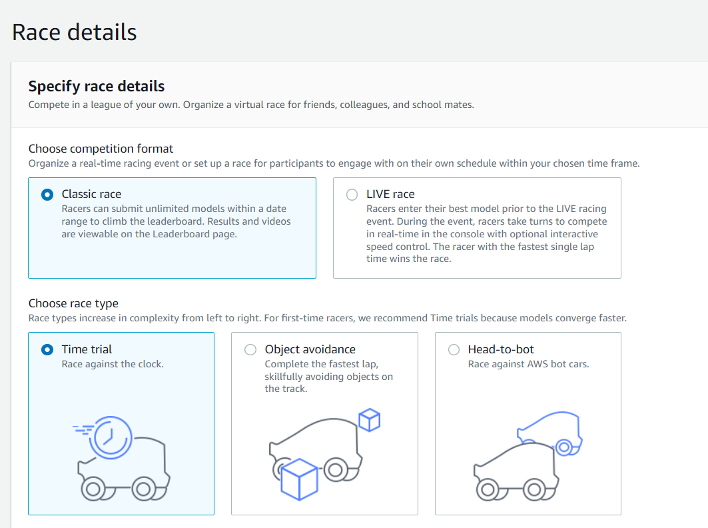

- Đặt tên và chọn ngày cuộc đua bắt đầu và nhấn **Next**

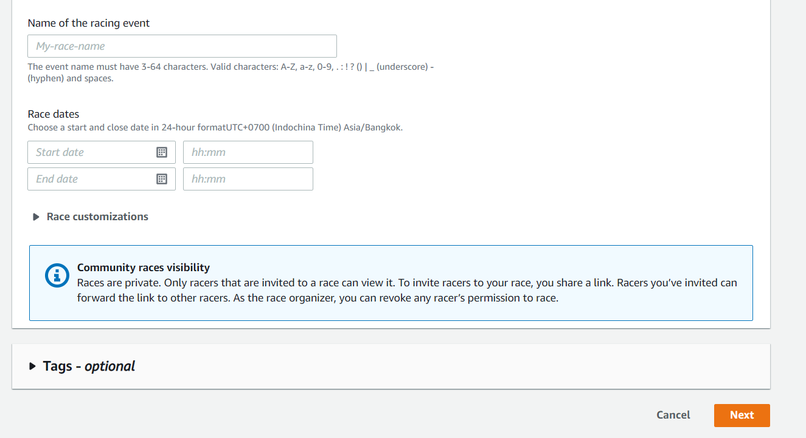

- Chọn đường đua mà mình muốn tạo

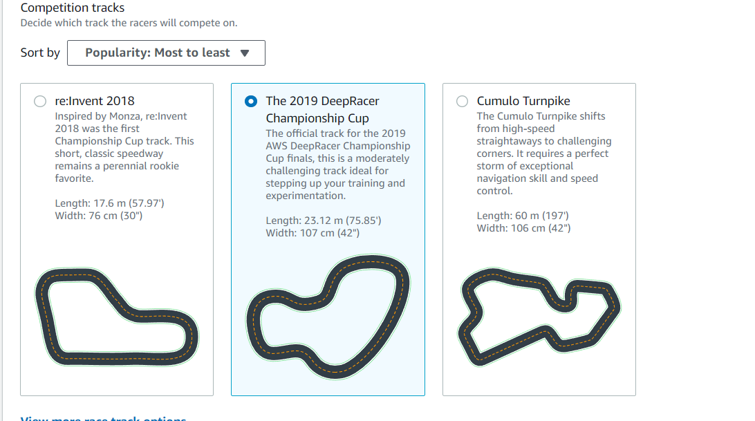

- Chỉnh sửa một vài thông số như điều kiện chiến thắng, số lap và khoảng dừng khi bị lệch khỏi đường đua sau đó nhất **Next**

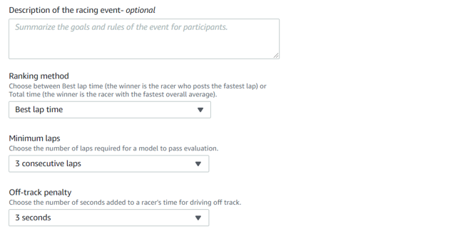

- Bảng review lại đường đua mình đã tạo hiện ra, nhấn **Submit**

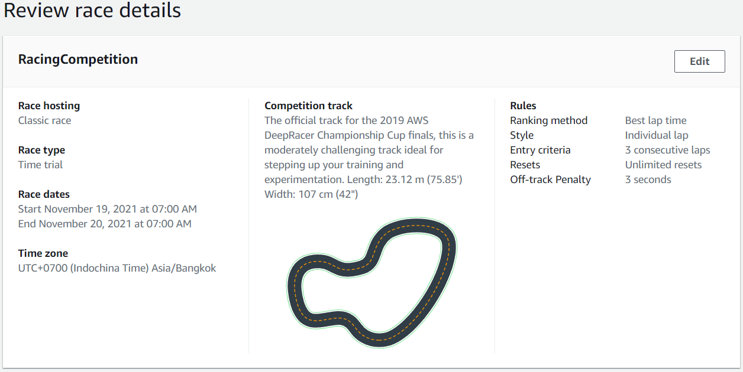

- Một đường dẫn sẽ xuất hiện, ta có thể gửi để mời bạn bè cùng tham gia

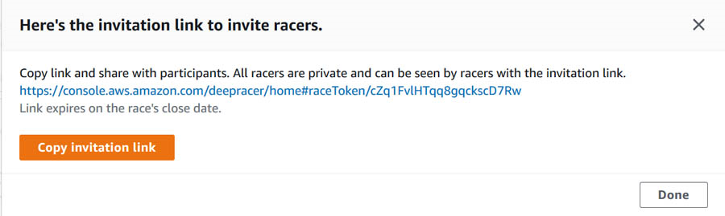

